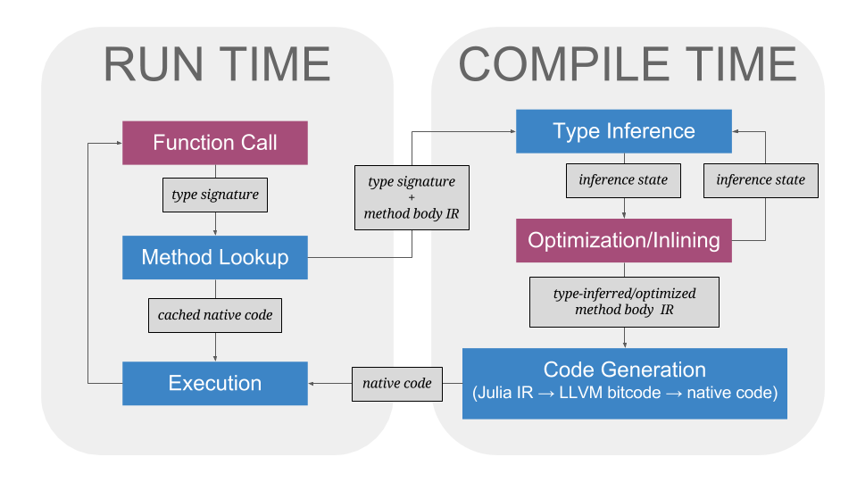

## Introduction to Cassette and Metadata Propagation

Cassette is a Julia package that provides a just-in-time (JIT) IR pass injection mechanism,
or **overdubbing mechanism**, that can be used to interleave external code transformations
with Julia's normal JIT-compilation cycle. As part of this overdubbing mechanism, Cassette
provides a **contextual execution framework** for the Julia language via the implementation
of **contextual dispatch** and **contextual metadata propagation**. This framework enables
users to define new "contexts" that overlay normal Julia methods that can then be dispatched
on using Julia's existing operator-overloading syntax. Using its overdubbing mechanism,
Cassette can equip context-unaware Julia code with context-specific behaviors, enabling
granular method interception and metadata propagation within "black-box" user code.

Downstream applications for Cassette include automatic differentiation, interval constraint
programming, dynamic code analysis (e.g. profiling, `rr`-style debugging, etc.), JIT
transpilation to GPU backends, automatic parallelization/rescheduling, memoization,
high-level automated memory management and code fuzzing.

Outside of Julia, the LLVM ecosystem has long benefitted from modular compiler extensions in
the form of the LLVM Pass Framework. In a similar vein, we hope that Cassette's overdubbing
mechanism can eventually be used to jump-start an ecosystem of Julia compiler "plugins" -
modular extensions that implement new compiler optimizations and features external to the
compiler itself. In fact, there is already [previous work in this
regime](https://github.com/IntelLabs/ParallelAccelerator.jl) that could drastically benefit
from a formal, standardized approach to compiler extension.

## Background: Julia's Compiler

To understand how Cassette works, one must first have at least a cursory knowledge of
where Cassette fits into Julia's run-compile cycle, as well as Julia's `@generated`
function feature. An explanation of the former is given in the following section, while an
explanation of the latter is given in [Julia's official `@generated` function
documentation](https://docs.julialang.org/en/latest/manual/metaprogramming/#Generated-functions-1).

### Julia's Run-Compile Cycle

A diagram of Julia's run-compile cycle is shown below. While this diagram is quite
incomplete<sup id="f1-anchor">[1](#f1)</sup>, it is sufficient for the purposes of
understanding Cassette.



Here, the colored boxes are phases of the run-compile cycle, the arrows denote execution
flow, and the gray boxes are the input/output of each phase. The red boxes are phases that
Cassette interacts with directly. Before we examine these interactions, here's an outline
of the process described by the diagram, starting at "Function Call":

1. A function call is the application of a callable Julia object (the function) on other
Julia objects (the arguments). The function call is resolved to its corresponding method
body by dispatching on the call's type signature. For example, `f(1.0, "a", [1 + im])` has
the type signature `Tuple{typeof(f),Float64,String,Vector{Complex{Int}}}`.

2. Dispatch occurs via a lookup performed on Julia's internal method table, using the
call's type signature as a kind of key. This method lookup can yield one of two results.
If the method body for this function call has already been compiled in the past, and
the cached native code from that compilation is still valid (a determination made via
Julia's "world-age" mechanism), then the rest of the compile cycle for this function
call is skipped and the cached native code is executed (i.e., we skip to step 6).
Otherwise, the method lookup yields an untyped Julia AST, represented in Julia's internal
intermediate representation (IR).

3. Assuming that there is no valid cached native code for the function call, Julia's
compiler performs type inference on the method body AST, leveraging the function call's
type signature as a starting point.

4. Various optimization passes - most notably, inlining and `@generated` function
expansion - are interleaved with Julia's type inference process, hence the cycle
formed between "Type Inference" and "Optimizations/Inlining".

5. The type inferred and optimized IR for the method body is passed to the compiler's
code generator, where the IR is converted into LLVM bitcode, which is in turn converted
to executable native code.

6. The native code is executed, potentially returning runtime values that are then fed
to another function call, at which point the cycle repeats.

<b id="f1">[1]</b> To be considered complete, this diagram would need to also have a
"parse time" section, which would include Julia AST construction and macro expansion.
[↩](#f1-anchor)

### Where Cassette Fits In The Run-Compile Cycle

As denoted by the red boxes in the run-compile diagram, Cassette interacts with the
"Function Call" and "Optimizations/Inlining" phases. Cassette interacts with the  "Function
Call" phase by wrapping target functions in a callable `Overdub` wrapper type,  whose call
definition is a special `@generated` function. This `@generated` function  exploits the
generator expansion that occurs during the "Optimization/Inlining" phase as an injection
site for Cassette's overdubbing mechanism. In short, the `@generated` call definition for
`Overdub` performs a method lookup in order to retrieve the original method's code, then
runs context-specific transformation passes on that code before returning it from the
generator.

In the case of Cassette's contextual execution framework, this overdubbing mechanism
facilitates a JIT-rewrite of the target method's code in order to propagate the context
type and any associated metadata to downstream function calls.

### Changes to Julia's Compiler

To facilitate the development of Cassette, several changes to the compiler have been
made, and several more are planned. Below is a list of relevant GitHub issues and pull
requests tracking the development of these changes:

- [JuliaLang/julia#22440](https://github.com/JuliaLang/julia/pull/22440): Allow `CodeInfo` objects to be returned directly from `@generated` functions
- [JuliaLang/julia#22938](https://github.com/JuliaLang/julia/pull/22938): Add a `CodeInfo` validator to Base
- [JuliaLang/julia#22979](https://github.com/JuliaLang/julia/pull/22979): Enable generator expansion for code reflection methods
- [JuliaLang/julia#22877](https://github.com/JuliaLang/julia/pull/22877): Improve performance of certain varargs functions
- [jrevels/Cassette#5](https://github.com/jrevels/Cassette/issues/5): Optimization of "pass-through" varargs functions
- [jrevels/Cassette#6](https://github.com/jrevels/Cassette/issues/6): World-age validation for certain kinds of `@generated` functions
- [jrevels/Cassette#7](https://github.com/jrevels/Cassette/issues/7): Generated `CodeInfo` inlining should occur in Base rather than in Cassette
- [jrevels/Cassette#9](https://github.com/jrevels/Cassette/issues/9): Performance overhead of `getfield` type-domain projection

## Cassette's Overdubbing Mechanism and Contextual Dispatch

As stated earlier, Cassette's overdubbing mechanism works by using a wrapper type whose
call definition is a `@generated` function that injects context-specific code
transformations into the compiler's "Optimization/Inlining" phase. In this section,
the overdubbing mechanism will be examined in more detail.

### A Simple Overdubbing Mechanism

Below is a simplified, mocked-out of version of Cassette's overdubbing mechanism that
only supports transformation pass injection:

```julia
# returns the world age within the current calling context
get_world_age() = ccall(:jl_get_tls_world_age, UInt, ())

# This callable struct will wrap the target function and every
# downstream function called by the target function in order to
# redirect dispatch based on the context.
#
# Note the inclusion of the current world age as a type parameter.
# This is necessary to force re-expansion/re-compilation of the call
# definition (the `@generated` function below) when the world age
# updates (for example, when a new method is added to `pass` below).
struct Overdub{F,C<:Context,w}
    func::F
    context::C
    world::Val{w}
end

Overdub(func, context) = Overdub(func, context, Val(get_world_age()))

# Given a context type `C`, returns a transformation pass of the form
# `f(::Type{S}, ::CodeInfo)::CodeInfo`. This default definition is
# simply the identity. Downstream code can overload this `pass` function
# for new context types.
pass(::Type{C}) where {C} = (signature, method_body) -> method_body

# Return the CodeInfo method body for type signature `S` and the world age `world`,
# if such a method exists in the method table. Otherwise, return `nothing`.
function lookup_method_body(::Type{S}, world::UInt) where {S<:Tuple}
    # ...
end

# Return `method_body` with every call expression wrapped in an `Overdub` carrying the
# same context and world as the caller (i.e. `f` in the `@generated` definition below).
# By convention, this caller is referenced in `CodeInfo` as `SlotNumber(1)`.
function overdub_calls!(method_body::CodeInfo)
    # ...
end

# This is the call definition for an `Overdub` wrapper.
@generated function (f::Overdub{F,C,world}})(args...) where {F,C,world}
    signature = Tuple{F,args...}
    method_body = lookup_method_body(signature, world)
    if isa(method_body, CodeInfo)
        # The `method_body` exists as `CodeInfo`, so we run the context's pass on
        # `method_body` and then wrap all downstream calls with `Overdub` instances
        # carrying the same context and world as `f`.
        method_body = overdub_calls!(pass(C)(signature, method_body))
    else
        # There is no retrievable method body, so just call the original function. This will
        # occur for Julia "built-in" functions, such as `getfield` or `arrayref`.
        method_body = :(f.func(args...))
    end
    return method_body
end
```

#### Overdubbing vs. Method Overloading

As demonstrated above, the contextual passes injected by Cassette's overdubbing mechanism
are functions from a type signature and an original method body to a new method body.
Experienced Julia developers might note here that Julia actually already *has* a convenient
mechanism for emitting specialized method bodies from type signatures: method overloading
with multiple dispatch. So, then, what is the advantage of Cassette?

To answer this question, we need only examine the alternative pattern currently dominating
the Julia ecosystem: creating new argument types, and explicitly overloading methods on
these types. **This pattern, while vital to idiomatic Julia programming in most cases,
exhibits a few significant problems when applied as an alternative to Cassette's overdubbing
mechanism**:

- *New subtypes must implement an informal/unchecked interface of their supertype,
regardless of the interface's (ir)relevance to the desired contextual transformation.* For
instance, this problem is evident when defining a new subtype requires implementing complex
conversion/promotion rules. These rules can exhibit and depend on [subtle behaviors](https://github.com/JuliaLang/julia/issues/17559),
and the required method overloads are not always evident given only a supertype. For a
real-world example, see [ForwardDiff's `Dual` number implementation](https://github.com/JuliaDiff/ForwardDiff.jl/blob/dd692d2f5c8014167a4d85c31d10d834361887fb/src/dual.jl#L306).

- *Type constraints in target programs drastically limit the domain of applicable code.*
Overly-strict type constraints are unavoidable in real-world code. Users and developers
often define methods with overly-strict type signatures to simplify development, or to
prevent code misuse. For example, if the goal was to intercept numeric code, then one
might define
    ```julia
    struct Foo{T<:Number} <: Number
        x::T
    end
    ```
    and intercept methods on `Foo`. Any methods of the form `f(::AbstractFloat)`, then,
    would be un-interceptable. Furthermore, even when one has access to target code and
    is allowed to modify it, post-hoc refactoring to loosen type restrictions can be
    quite an arduous task, and add to future maintenance burden (since future
    code must also be written generically). For a real-world example, see
    [JuliaStats/Distributions.jl#511](https://github.com/JuliaStats/Distributions.jl/pull/511).

- *Naive application of the pattern results in difficult-to-resolve dispatch ambiguities.*
More accurately, module-local information is not sufficient to easily discover and resolve
ambiguities between two different subtypes of the same supertype when extending a
multi-arity method on the supertype. Take the following example, imagining that
all three modules were written by different authors, and that`MA`'s author and
`MB`'s author are unaware of each other:
    ```julia
    module M
        abstract type T end
        f(::T, ::T) = "hello"
    end

    module MA
        using Main.M
        struct A <: M.T end
        M.f(::A, ::A)= 1
        M.f(::A, ::M.T) = 1
        M.f(::M.T, ::A) = 1
    end

    module MB
        using Main.M
        struct B <: M.T end
        M.f(::B, ::B) = 2
        M.f(::B, ::M.T) = 2
        M.f(::M.T, ::B) = 2
    end
    ```
    In practice, this scenario can commonly when two non-Base packages each implement a subtype
    of the same Base supertype and extend the same Base method as part of implementing the
    supertype's interface.

    If a user tried to compose these modules, they'd be in for a nasty surprise:

    ```julia
    julia> M.f(MA.A(), MB.B())
    ERROR: MethodError: Main.M.f(::Main.MA.A, ::Main.MB.B) is ambiguous. Candidates:
      f(::Main.M.T, ::Main.MB.B) in Main.MB at REPL[3]:6
      f(::Main.MA.A, ::Main.M.T) in Main.MA at REPL[2]:5
    Possible fix, define
      f(::Main.MA.A, ::Main.MB.B)
    ```

    For `Number` types, Julia's solution to this problem is to apply a map from the multiple
    dispatch case to the single dispatch case via it's conversion/promotion mechanism. However,
    this mechanism is only sensible in regimes where conversion between subtypes is cheap
    and well-defined.

    For a real-world example of this problem, see [JuliaDiff/ReverseDiff.jl#64](https://github.com/JuliaDiff/ReverseDiff.jl/issues/64).

- *Even with the aid of metaprogramming, explicit method overloading can only reflect on
extant types/methods, potentially causing problems due to load order dependencies.* Imagine
that the hypothetical module authors in our previous scenario were aware of this ambiguity
problem, but still not aware of each other. They might then attempt to resolve the
ambiguities via a bit of metaprogramming:
    ```julia
    module MA
        using Main.M
        struct A <: M.T end
        for S in (M.T, subtypes(M.T)...)
            @eval begin
                M.f(::A, ::A)= 1
                M.f(::A, ::$S) = 1
                M.f(::$S, ::A) = 1
            end
        end
    end

    module MB
        using Main.M
        struct B <: M.T end
        for S in (M.T, subtypes(M.T)...)
            @eval begin
                M.f(::B, ::B)= 2
                M.f(::B, ::$S) = 2
                M.f(::$S, ::B) = 2
            end
        end
    end
    ```
    This solution, while naively appealing since it gets rid of the error, is actually in some
    sense worse than the original problem. If one loads `MA` before `MB`, then
    `M.f(MA.A(), MB.B()) == 2`. If one loads `MB` before `MA`, then `M.f(MA.A(), MB.B()) == 1`.
    In other words, downstream code becomes "silently" load-order dependent!

- *Important built-in methods are not overloadable (e.g. `getfield`, `arrayset`).*

- *Functions of variable arity are non-trivial to intercept correctly.* See, for example,
[denizyuret/Knet.jl#112](https://github.com/denizyuret/Knet.jl/issues/112).

In summary, Cassette's advantage over Julia's built-in method overloading is that it allows
context-specific method body transformations to proliferate throughout *any* code
running in the contextual "environment" without requiring explicit overloads to occur
for all downstream function calls.

### Contextual Dispatch

As an alternative to implementing overdub passes directly, Cassette provides an additional
dispatch layer on top of Julia's existing multiple dispatch mechanism. This "contextual
dispatch" layer enables the use of Julia's normal method overloading semantics to inject
new behaviors, while solving many of the method overloading problems listed in the previous
section. When applicable, Cassette's contextual dispatch is usually far easier and safer to
use than implementing the equivalent overdub pass manually.

Here is an example demonstrating how contextual dispatch can be used to print out all
functions that are called in a context, and replace all `sin` calls with `cos` calls:

```julia
using Cassette: @context, @hook, @execute, @execution, @isprimitive, @primitive

# Define a new context type called "MyCtx"
@context MyCtx

# Define a hook method that will be called as a side-effect
# for every matching method called during contextual execution.
# Note that this form (along with all other contextual dispatch
# macros) uses Julia's built-in generic syntax for
# method overloading, so we could use any of Julia's normal
# dispatch features (function/argument dispatch, type variables,
# etc.) here if we so desired.
@hook MyCtx f(args...) = println("calling ", f, args)

# Define the execution behavior of `sin` in `MyCtx`.
@execution MyCtx (::typeof(sin))(x) = cos(x)

# Mark the method with this signature as a Cassette primitive.
# If we don't do this, our `@execution` definition will never
# get called, because Cassette will just recursively overdub
# `sin` calls rather than treat them as primitives.
@isprimitive MyCtx (::typeof(sin))(x)

# This is sugar for defining `@execution` and `@isprimitive` at the same time
@primitive MyCtx (::typeof(sin))(x) = cos(x)
```

After making the above definitions, we can execute code within the `MyCtx` context and
see the result:

```julia
julia> f(x) = sin(x) + cos(x)
f (generic function with 1 method)

julia> result = @execute MyCtx f(1.0)
calling f(1.0,)
calling sin(1.0,)
calling cos(1.0,)
calling abs(1.0,)
calling abs_float(1.0,)
calling Float64(π = 3.1415926535897...,)
calling convert(Float64, π = 3.1415926535897...)
calling typeassert(3.141592653589793, Float64)
calling /(3.141592653589793, 4)
calling promote(3.141592653589793, 4)
⋮ # there are around 200 more calls in this trace, but we elide them for brevity
1.0806046117886654

julia> result === 2 * cos(1.0)
true
```

#### Extending the Overdub Mechanism to Support Contextual Dispatch

Contextual dispatch is implemented by breaking the overdub mechanism up into two "phases":
the interception phase and the execution phase.

The interception phase is nearly the same as the previously shown pseudo-implementation of
`Overdub`; during the interception phase, a call is intercepted, its lowered form is
retrieved, a contextual transformation pass is run on it, and the mechanism is propagated
to downstream calls by wrapping them in the `Overdub` wrapper. The interception phase
differs from the previous `Overdub` implementation in that downstream `Overdub` calls
redirect to an execution phase rather than cycling back through the interception phase.

During the execution phase, Cassette calls the context's hook method (defined via `@hook`,
and a no-op by default), then checks the underlying method's type signature to see whether
or not it was defined as a "primitive" for the context via `@isprimitive`. If so, Cassette's
special `execution` method (overloaded via `@execution`) is called in place of the original
call. Otherwise, Cassette redirects the call to the interception phase, and the cycle starts
again, continuing recursively until a primitive or unreflectable call is reached.

For clarity's sake, let's extend our previous `Overdub` pseudo-implementation to support
contextual dispatch (code that remains unchanged from the previous example will be elided
for brevity):

```julia
abstract type Phase end
struct Execute <: Phase end
struct Intercept <: Phase end

# Here, we've added the `phase::P<:Phase` field, which we'll use for dispatch later.
struct Overdub{P<:Phase,F,C<:Context,w}
    phase::P
    func::F
    context::C
    world::Val{w}
end

Overdub(phase, func, context) = Overdub(phase, func, context, Val(get_world_age()))

# `hook` is overloaded for different context types via Cassette's `@hook` macro.
# It returns `nothing` by default.
hook(o::Overdub, args...) = hook(o.context, o.func, args...)
hook(::Context, f, args...) = nothing

# `isprimitive` is overloaded for different context types via Cassette's `@isprimitive` macro
# It returns `Val(false)` by default.
isprimitive(o::Overdub, args...) = isprimitive(o.context, o.func, args...)
isprimitive(::Context, f, args...) = Val(false)

# `execution` is overloaded for different context types via Cassette's `@execution` macro
# It simply executes the original function by default.
execution(::Context, f, args...) = f(args...)

# Here, call `execution` if `isprimitive` returns `Val(true)`, otherwise call the underlying
# function wrapped in an `Intercept`-phase `Overdub` wrapper.
execute(o::Overdub, args...) = execute(isprimitive(o, args...), o, args...)
execute(::Val{true}, o::Overdub, args...) = execution(o.context, o.func, args...)
execute(::Val{false}, o::Overdub, args...) = Overdub(Intercept(), o.func, o.context, o.world)(args...)

# In other words, instead of replacing `g` with `Overdub(g, f.context, f.world)`,
# `g` is replaced with `Overdub(Execute(), g, f.context, f.world)` (where `f` is
# `SlotNumber(1)`).
function overdub_calls!(method_body::CodeInfo)
    # ...
end

# This is nearly the same call definition as before, but is dispatch-restricted to the
# `Intercept` phase. Note the change in the non-reflectable case.
@generated function (f::Overdub{Intercept,F,C,world}})(args...) where {F,C,world}
    signature = Tuple{F,args...}
    method_body = lookup_method_body(signature, world)
    if isa(method_body, CodeInfo)
        method_body = overdub_calls!(pass(C)(signature, method_body))
    else
        # Instead of calling the function directly as we did previously,
        # we call it as a contextual primitive via the `execute` method.
        method_body = :(execute(Val(true), f, args...))
    end
    return method_body
end

# The call definition for `Overdub{Execute}` simply calls `hook` and `execute`.
(o::Overdub{Execute})(args...) = (hook(o, args...); execute(o, args...))
```

## Cassette's Contextual Metadata Propagation

Until this section, our focus has been on using Cassette to inject context-specific
*functional behaviors* that can either transparently overlay or invasively redirect the
functional behaviors of underlying target programs. In this section, our focus shifts
towards using Cassette to inject context-specific *state*, or metadata, that similarly can
overlay or interact with target program state. Use cases in this regime include automatic
differentiation, convexity detection, and interval constraint propagation. Traditionally in
the Julia landscape, this regime has encountered the same problems covered by the earlier
section on [Overdubbing vs. Method Overloading](#overdubbing-vs-method-overloading).

### Trace-Level Metadata

The simplest component of Cassette's contextual metadata propagation system is "trace-level"
metadata, or metadata that propagates as a single instance throughout the contextual
execution of a program, and is accessible at every point of contextual dispatch in the
execution trace.

For example, the following code uses trace-level metadata to count the number of calls
where all argument types are `<:Number`:

```julia
julia> using Cassette: @context, @hook, @execute

julia> @context CountCtx

# This expands to something like
#
#     Cassette.hook(::CountCtx, c, f, args::Number...) = ...
#
# ...where the `c` argument propagates via a field of the `Overdub`
# wrapper that calls `hook`. Note that since `c` is a normal argument,
# you can also dispatch on its type.
julia> @hook CountCtx c f(::Number, ::Number...) = (c[] += 1; println("count is now ", c[], " due to ", f))

julia> count = Ref(0) # this will be our trace-level metadata
Base.RefValue{Int64}(0)

julia> @execute CountCtx count sin(1)
count is now 1 due to sin
count is now 2 due to float
count is now 3 due to sin
count is now 4 due to abs
⋮ # elided for brevity
count is now 140 due to +
count is now 141 due to add_float
count is now 142 due to +
count is now 143 due to add_float
0.8414709848078965

julia> count
Base.RefValue{Int64}(143)
```

Below is a more involved example, similar to the above in that only functions of certain
argument types are counted. Here, however, we use dispatch to make the intercepted argument
type a configurable parameter:

```julia
julia> using Cassette: @context, @hook, @execute

julia> mutable struct Count{T}
           x::Int
       end

julia> @context CountCtx

julia> @hook CountCtx c::Count{T} function f(::T, ::T...) where {T}
            c.x += 1
            println("count is now ", c.x, " due to ", f)
       end

julia> count = Count{String}(0)
Count{String}(0)

julia> @execute CountCtx count repr(rand(10))
count is now 1 due to Array{UInt8,1}
count is now 2 due to pointer
count is now 3 due to pointer_from_objref
count is now 4 due to sizeof
count is now 5 due to Core.sizeof
count is now 6 due to Array{UInt8,1}
"[0.850452, 0.0270932, 0.442993, 0.585945, 0.734315, 0.642504, 0.665375, 0.168887, 0.985633, 0.916614]"

julia> count
Count{String}(6)

# now let's count the number of calls to `f(::Number...)` functions
julia> count = Count{Number}(0)
Count{Number}(0)

julia> @execute CountCtx count repr(rand(10))
count is now 1 due to Base.GenericIOBuffer{Array{UInt8,1}}
count is now 2 due to Base.StringVector
⋮ # elided for brevity
count is now 209 due to ==
count is now 210 due to ===
"[0.670988, 0.176888, 0.586795, 0.596653, 0.257753, 0.439668, 0.374046, 0.104243, 0.441718, 0.927184]"

julia> count
Count{Number}(210)
```

In order to support trace-level metadata, the `Overdub` type must carry and propagate an
additional `metadata` field. The new `metadata` field essentially follows the `context`
field, and is passed around to all the same functions, e.g. `hook`, `execution`,
`isprimitive` etc. This implementation change is simple enough that it is not recreated
here.

### Argument-Level Metadata

There are many use cases, such as forward-mode automatic differentiation, where metadata is
associated with local arguments rather than global traces. To facilitate these cases,
Cassette provides a special `Wrapper` functor type which stores underlying values and their
associated metadata. `Wrapper` type instances are tied to the contexts in which they are
constructed, enabling Cassette to employ contextual dispatch to propagate `Wrapper`s
through underlying program state, even in the presence of type constraints that
would normally disallow such propagation.

#### Propagation Through Dispatch Type Constraints

Consider the following example:

```julia
julia> using Cassette: @context, @execute

# This is just an identity function with a side-effect. Note the `x::Int` restriction.
julia> baz_identity(x::Int) = (println((x + x) * sin(x)); x)
baz_identity (generic function with 1 method)

# We'll use this as our metadata
julia> n = rand()
0.513223968007092

julia> @context BazCtx

# Here, we use Cassette's `@Wrapper` macro to associate the metadata `n` with an underlying
# value `1`, then contextually call `baz_identity` on the wrapped instance. Note that the
# result is still wrapped, and is `===` to the input (as we'd expect from an identity
# function like `baz_identity`), proving that Cassette is able to propagate metadata
# through dispatch type constraints.
julia> @execute BazCtx baz_identity(@Wrapper(1, n))
1.682941969615793
Wrapper(1, Meta{Active}(0.513223968007092, @anon()))
```

In this example, the `Wrapper` instance propagates through the computation despite the
dispatch constraints on both the target function (`baz_identity`) and downstream functions
(`+`, `*`, `sin`).

Propagation through dispatch constraints is naturally achieved via the additional dispatch
layer granted by the overdubbing mechanism. That is, underlying dispatch constraints never
interfere with `Wrapper` propagation because dispatch-constrained methods (like
`baz_identity`) are never directly called. Instead, Cassette is executing the previously
described `Overdub` call method, which has no such dispatch constraints.<sup id="f2-anchor">[2](#f2)</sup>

Since all downstream function calls are wrapped in `Overdub`, `Wrapper` instances can
naturally pass through overdubbed code, and only need to be explicitly handled at the
primitive execution sites where `Cassette.execution` is called. Recall that the default
behavior of `Cassette.execution` is to simply call the underlying function with the original
arguments. We can easily modify this behavior to support `Wrapper` arguments by unwrapping
all values before calling the function, using code similar to the following:

```julia
# contextually extract wrapped values
unwrap(::Context, x) = x
unwrap(::C,       x::Wrapper{C}) where {C<:Context} = x.value

# call `f` with all arguments unwrapped w.r.t. `ctx`
unwrapcall(f, ctx::Context, args...) = unwrap(ctx, f)(map(x -> unwrap(ctx, x), args)...)

# the new execution method uses `unwrapcall` instead of calling the function directly
execution(ctx::Context, f, args...) = unwrapcall(f, ctx::Context, args...)
```

Note that the `unwrap` is written such that `Wrappers` can only be unwrapped with respect to
their associated context. For example, if one calls `unwrap(::A, w::Wrapper{B})` where
context `A` and `B` are unequal, then `w` is simply returned unchanged, since `w` is nothing
more than an underlying program value from the perspective of context `A`. These  kinds of
semantics are essential for solving a class of problems known as [Metadata Confusion](#metadata-confusion),
which will be described in a later section.

<b id="f2">[2]</b> Bypassing dispatch constraints at this point does not break underlying
program semantics, since Cassette still uses the original type signature to look up the
original method body. Following our example, given the type signature
`Tuple{Overdub{Intercept,typeof(baz_identity),Ctx{0xb5b36b77685cfd1d}},Wrapper{Ctx{0xb5b36b77685cfd1d},Int64,Float64}}`
Cassette will perform a method body lookup with the type signature `Tuple{typeof(baz_identity),Int64}`.
[↩](#f2-anchor)

#### Propagation Through Structural Type Constraints

Consider this more complex version of the previous section's example:

```julia
julia> using Cassette: @context, @execute

# Baz's fields are restricted to concrete leaf type
julia> struct Baz
           x::Int
           y::Float64
           z::String
       end

# A different version of `baz_identity`, which constructs and prints a `Baz` instance before
# returning the original input.
julia> baz_identity(x::Int) = (baz = Baz(x, float(x), "$x"); println(baz); baz.x)
baz_identity (generic function with 1 method)

# once again, we'll use a random Float64 as our metadata
julia> n = rand()
0.7041067151514468

julia> @context BazCtx

# Just like before, the result is correctly `===` to the original input.
julia> @execute BazCtx baz_identity(@Wrapper(1, n))
Baz(1, 1.0, "1")
Wrapper(1, Meta{Active}(0.7041067151514468, @anon()))
```

In this example, Cassette is bypassing two different constraints on `x`: the dispatch
constraints of the target and downstream functions, and the structural `Int` constraint
on `Baz`'s `x` field. We covered the former in the previous section, so here we will
describe how Cassette achieves the latter.

The central idea enabling this ability is that a `Wrapper` always persists metadata
at the outermost "strutural layer." In other words, a `Wrapper` instance is never contained
within an outer structure. If a new type instance is constructed with `Wrapper` values
as the field arguments, these values are instead unwrapped and any associated metadata
is "bubbled up" to a new outer `Wrapper` that persists the metadata in an external "field
map". This is implemented by hijacking Julia's built-in `new` constructor, which isn't a
normal function, but rather a special kind of `Expr` defined for use in Julia's IR.

As part of the overdubbing process, Cassette extends the built-in AST pass described in
earlier sections to replace all `new` nodes in reflected method bodies with calls to
`Cassette.wrapper_new`. This replacement constructor intercepts all `Wrapper` arguments,
calls the original constructor on the arguments' unwrapped values, then wraps the newly
constructed instance in a fresh `Wrapper` with the arguments' metadata intact.

For example, during contextual execution, `Baz(Wrapper(x, n), y, Wrapper(z, m))` would
resolve to something like `Wrapper(Baz(x, y, z); x = n, z = m)`, where the keyword argument
notation denotes the field mapping persisted by the outermost `Wrapper`. This field map
is implemented on top of [Cassette's internal "anonymous type" functionality](https://github.com/jrevels/Cassette.jl/blob/master/src/utilities/anonymous.jl),
which allows `Wrapper`s to directly mirror the field structure of their underlying values.

In addition to hijacking `new`, Cassette also intercepts `getfield` and `setfield!`, such
that field accesses on `Wrapper`s will return correctly (un)wrapped values, e.g.
`Wrapper(Baz(x, y, z); x = n, z = m).z` must yield `Wrapper(z, m)`. Since `getfield` and
`setfield!` are actual Julia functions (though built-ins), they can be contextually
dispatched on. Thus, for every new context type `Ctx`, Cassette automatically defines:

```julia
@execution ctx::$Ctx (::typeof(Core.getfield))(x, field) = Cassette._getfield(x, field)
@execution ctx::$Ctx (::typeof(Core.setfield!))(x, field, y) = Cassette._setfield!(x, field, y)
```

where `Cassette._getfield` and `Cassette._setfield!` are `Wrapper`-aware and behave as one
would expect.

Note that the strategy described here also works for Julia's built-in `Array`s, but the
Cassette implementation for this strategy is not yet complete. Theoretically, it is
similar enough to the `struct` wrapping strategy that it does not merit its own
description.

<!--

### Implementing Wrappers With Anonymous Types

### Dispatching on Wrappers

#### Metadata Confusion


TODO: new sections

# Application Examples

## Forward-Mode Automatic Differentiation

# Design Goals and Hurdles

This document's focus so far has been on describing Cassette, the problems it solves, and
the mechanisms that enable these solutions. This section was written to convey the design
hurdles/goals that were overcome during development, the most significant of which was
achieving nestability and composability for independent contexts.

# Future Work

-->
## Relation to Other Programming Paradigms

Cassette's contextual dispatch seems conceptually similar to the mechanisms that
underlie "aspect weaving" as defined by [aspect-oriented programming (AOP)](https://en.wikipedia.org/wiki/Aspect-oriented_programming).
In some sense, Cassette's call hooks can be used to provide AOP-style "advice", where
the pointcuts are specified via Julia's multiple dispatch mechanism.

Cassette's contextual metadata propagation system is heavily inspired by the functional
data propagation idioms made popular by languages like Haskell, specifically the pattern
of arranging concerns and managing state via layering functors. This particular style of
programming was [recently dubbed "functor-oriented programming" by Russel O'Connor](http://r6.ca/blog/20171010T001746Z.html).

For more work concerning the combination of aspect-oriented and functional programming
techniques, De Meuter's "Monads as a theoretical foundation for AOP" (1997) is a [useful
starting place](https://scholar.google.com/scholar?start=0&hl=en&as_sdt=0,22&sciodt=0,22&cites=3110450170580690333&scipsc=).
